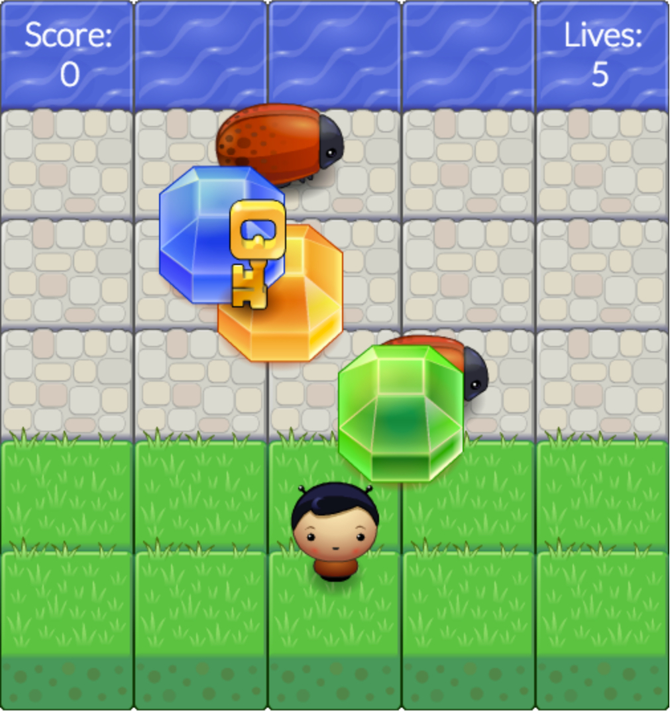

# Frogger Game Clone

This is a modified version of the classic Frogger Game, where the player must avoid the enemy as they cross
towards the water. The following is a preview of the game you'll come to play.




>	This is a modified version of the frogger game clone, based on the Udacity project that can be
>	found [here](https://github.com/udacity/frontend-nanodegree-arcade-game).

## Rules of the Game

1. Player must cross towards the water by avoiding all obstacles.
2. Every time the player reaches the water, the player is awarded "1" Point.
3. Player can collect tokens to increase their score.
4. Every token collected adds "20" Points to their score. Tokens don't help you win the game.
5. Player has 5 lives. By colliding with the enemy, a player loses a live and restarts. Tokens restart
	as well.
6. There is no timer in this game, so enjoy getting the highest score you can :)

In order to play the game, you need to initiate a small server in the Terminal with Python in the main resume directory:

```Shell
python -m SimpleHTTPServer
```
Go to 0.0.0.0:8000 on your browser to begin playing.

### Repository Content
1. index.html - Main file to play the game
2. images/ - Images folder. You can place your own designs if you wish.
3. css/style.css - Stylesheet. Leave as is.
4. js/engine.js - File provided by Udacity. Modified for this game.
5. js/resources.js - File provided by Udacity. Leave as is.
6. js/app.js - Main javascript file developed by me. Edit the classes and methods as you see fit.

I'll be continuously updating the design of this repository whenever I can. If you like to contribute or have
any questions, email me at: yaz.khoury@gmail.com

#### Bibliography
1. Inspiration from these repositories: https://github.com/akboada/arcade-game, https://github.com/abkendal/Grogger
2. Collision Detection: http://www.iguanademos.com/Jare/docs/html5/Lessons/Lesson2/
3. Score Keeping: http://code.tutsplus.com/articles/html5-avoider-game-tutorial-keeping-score--active-10292


